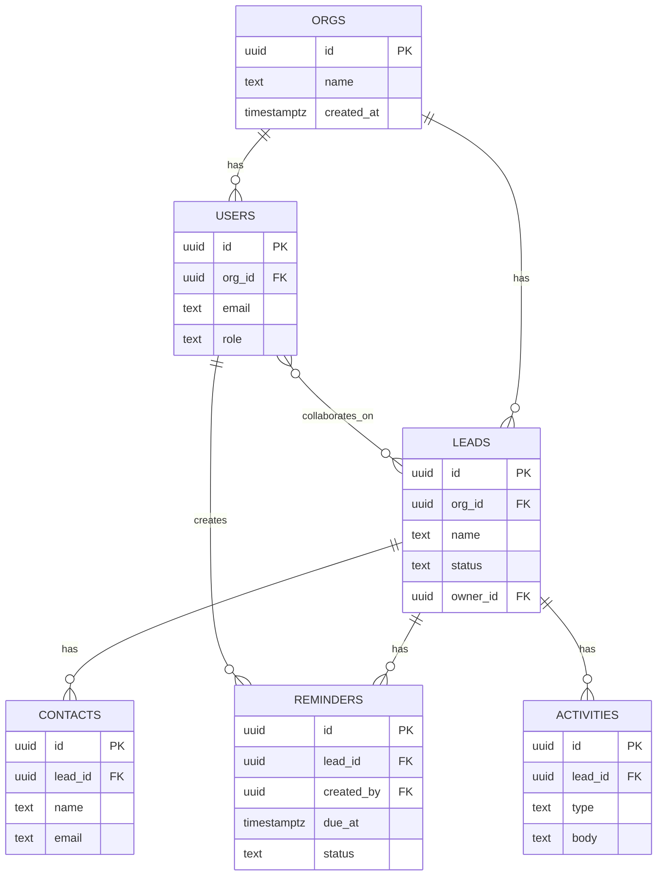

# DATABASE_SPEC.md

**Phase:** I — Instruction
**Purpose:** The schema-design template that turns your product's entities into a concrete, AI-buildable database. A vague data model is the #1 cause of mid-build rewrites — get the entities, relationships, and constraints right here before any table gets created.

> Fill every bracket. Each section includes a worked example using a simple CRM ("Leads + Contacts + Activities") so you can see the expected depth.

---

## 1. Entity List

> List every entity (table) the product needs. One row per entity, plain language first — formal schema comes in Section 2.

| Entity | Description | Owned by (tenant scope) |
|---|---|---|
| [orgs] | [the paying account / workspace] | [n/a — root entity] |
| [users] | [a person who logs in] | [org] |
| [leads] | [a prospective customer record] | [org] |
| | | |

**Worked example:**

| Entity | Description | Owned by (tenant scope) |
|---|---|---|
| orgs | A paying workspace/account | n/a — root entity |
| users | A person who can log in | org |
| leads | A prospective customer record | org |
| contacts | A person associated with a lead | org (via lead) |
| activities | A logged interaction (call, email, note) | org (via lead) |
| reminders | A scheduled follow-up on a lead | org (via lead) |

---

## 2. Fields, Types & Constraints

> One table per entity. Be explicit about nullability and constraints — "string" is not a type, "varchar(255) not null" is.

### `[entity_name]`

| Field | Type | Constraints | Notes |
|---|---|---|---|
| id | uuid | primary key, default gen_random_uuid() | |
| [field] | [type] | [nullable? unique? default?] | |

**Worked example — `leads`:**

| Field | Type | Constraints | Notes |
|---|---|---|---|
| id | uuid | primary key, default gen_random_uuid() | |
| org_id | uuid | not null, references orgs(id) on delete cascade | tenant scope |
| name | text | not null | |
| email | text | not null, unique per org_id (composite) | enforced via partial unique index |
| status | text | not null, default 'new', check in ('new','contacted','qualified','won','lost') | |
| owner_id | uuid | nullable, references users(id) | assigned rep |
| created_at | timestamptz | not null, default now() | |
| updated_at | timestamptz | not null, default now() | updated via trigger |

**Worked example — `reminders`:**

| Field | Type | Constraints | Notes |
|---|---|---|---|
| id | uuid | primary key, default gen_random_uuid() | |
| org_id | uuid | not null, references orgs(id) on delete cascade | |
| lead_id | uuid | not null, references leads(id) on delete cascade | |
| created_by | uuid | not null, references users(id) | |
| due_at | timestamptz | not null | |
| note | text | nullable | |
| status | text | not null, default 'pending', check in ('pending','sent','snoozed','done') | |
| created_at | timestamptz | not null, default now() | |

---

## 3. Relationships

> State each relationship's cardinality and what enforces it.

| Relationship | Type | Enforced by |
|---|---|---|
| [org → users] | [1:many] | [foreign key users.org_id] |
| | | |

**Worked example:**

| Relationship | Type | Enforced by |
|---|---|---|
| orgs → users | 1:many | `users.org_id` FK |
| orgs → leads | 1:many | `leads.org_id` FK |
| leads → contacts | 1:many | `contacts.lead_id` FK |
| leads → activities | 1:many | `activities.lead_id` FK |
| leads → reminders | 1:many | `reminders.lead_id` FK |
| users → reminders (created_by) | 1:many | `reminders.created_by` FK |
| users ↔ leads (team collaboration) | many:many (optional, if leads can have multiple collaborators) | junction table `lead_collaborators (lead_id, user_id)` |

---

## 4. Example ERD (mermaid)



> Replace the entities above with your own. Keep the mermaid block — it renders in GitHub, Notion, and most AI chat tools that support markdown preview.

---

## 5. Indexing Notes

| Table | Index | Why |
|---|---|---|
| [table] | [columns] | [query pattern this supports] |

**Worked example:**

| Table | Index | Why |
|---|---|---|
| leads | `(org_id, status)` | Dashboard filters leads by status within an org |
| leads | `(org_id, created_at desc)` | Default sort on lead list view |
| reminders | `(due_at) where status = 'pending'` | Cron job scans only pending, due-soon reminders — partial index keeps it small |
| activities | `(lead_id, created_at desc)` | Lead detail page loads activity timeline |
| leads | unique `(org_id, lower(email))` | Prevent duplicate leads per org by email, case-insensitive |

---

## 6. Migration Strategy

- **Tooling:** [e.g. Supabase CLI migrations / Prisma Migrate / Drizzle Kit / raw SQL files in `/migrations`]
- **Naming convention:** [e.g. `YYYYMMDDHHMM_description.sql`]
- **Process:**
  1. [Write migration locally, test against local/dev DB]
  2. [Run migration against staging, verify with smoke test]
  3. [Run migration against production during low-traffic window]
  4. [Never edit a migration that has already run in any shared environment — write a new one]
- **Rollback plan:** [e.g. every migration has a paired down-migration, or a documented manual rollback step]
- **Breaking changes (column drops/renames):** [e.g. always do a 2-step migration: add new column → backfill → switch reads → drop old column in a later release]

**Worked example:**
```
Tooling: Supabase CLI (`supabase migration new`, `supabase db push`)
Naming: 20260620_add_reminders_table.sql
Process: local → staging (smoke test: create+dispatch a test reminder) → production
Rollback: each migration paired with a manual DOWN script stored in /migrations/down/
Breaking change example: renaming leads.status → leads.stage was done as
  (1) add leads.stage, (2) backfill from status, (3) ship code reading stage,
  (4) drop status in a follow-up migration after 1 release cycle.
```

---

## 7. Sample Seed Data

```sql
-- Worked example seed data for local development

insert into orgs (id, name) values
  ('11111111-1111-1111-1111-111111111111', 'Acme Consulting');

insert into users (id, org_id, email, role) values
  ('22222222-2222-2222-2222-222222222222', '11111111-1111-1111-1111-111111111111', 'owner@acme.test', 'owner');

insert into leads (id, org_id, name, email, status, owner_id) values
  ('33333333-3333-3333-3333-333333333333', '11111111-1111-1111-1111-111111111111',
   'Jane Prospect', 'jane@prospect.test', 'new', '22222222-2222-2222-2222-222222222222');

insert into reminders (org_id, lead_id, created_by, due_at, note, status) values
  ('11111111-1111-1111-1111-111111111111',
   '33333333-3333-3333-3333-333333333333',
   '22222222-2222-2222-2222-222222222222',
   now() + interval '2 days',
   'Follow up on proposal sent last week',
   'pending');
```

> Replace with seed data for your own entities. Keep IDs predictable (sequential/static UUIDs) in dev seed data so test scripts and screenshots stay reproducible.

---

**Next step:** Hand this file alongside `TECH_SPEC.md` and `AI_BUILD_SPEC.md` to your AI builder in the Technical Spec stage of [`PROMPTS.md`](./PROMPTS.md).
